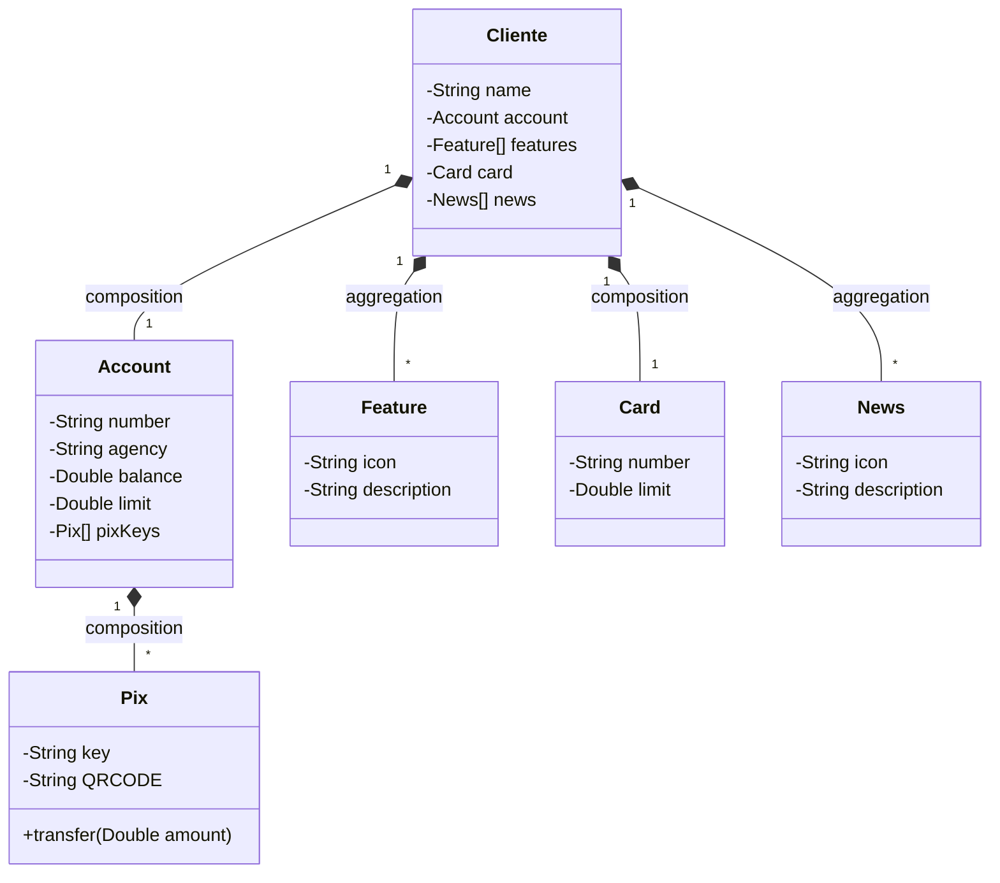
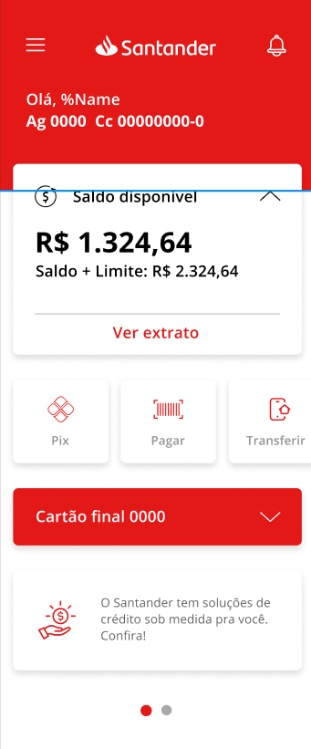

# Projeto Digital Banking✔ - Com Implementação Pix🔑

## 📌 Visão Geral
Projeto desenvolvido como parte do curso da Digital Innovation One, com a **contribuição adicional** da funcionalidade Pix, incluindo:
- Gerenciamento de chaves Pix (CPF, e-mail, telefone)
- Geração de QR Codes para pagamentos
- Integração com o sistema bancário existente
  
## 🌟 Minha Contribuição
### Implementação do Módulo Pix
Desenvolvi **o subsistema Pix**, uma funcionalidade **deixada de lado na projeto da aula**.
### Endpoint Especializado
Criei um endpoint RESTful para consulta segura de usuários e suas chaves apartir do **DTO**.

## 🛠️ Tecnologias
- **Backend**:
  - Java 17
  - Spring Boot 3.2.6
  - Spring Data JPA
  - Hibernate Validator
- **Banco de Dados**:
  - PostgreSQL (Produção - Railway)
  - H2 (Testes locais)
- **Ferramentas**:
  - Railway (Deploy)
  - Git/GitHub (Versionamento)

## 📌 Diagrama de Entidades

## 📌 Template que o projeto foi baseado.
 
